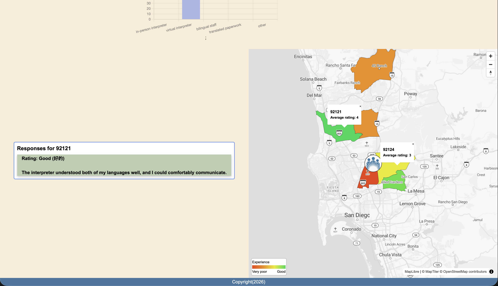
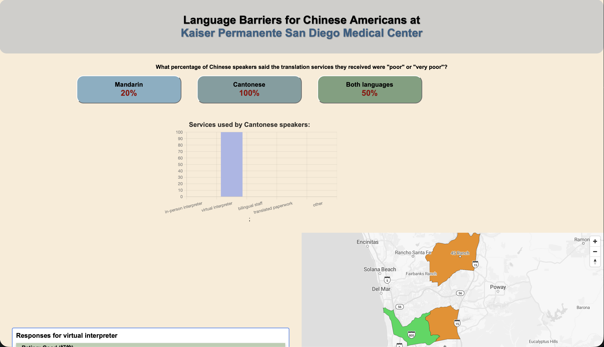

# Language Barriers for Chinese Americans at Kaiser Permanente San Diego Medical Center

## Table of Contents
* [Objective](#objective)
* [Who is being empowered](#who-is-being-empowered)
* [Technologies Used](#technologies-used)
* [How it can be repurposed](#how-it-can-be-repurposed)
* [Features](#features)
* [Screenshots](#screenshots)

## Objective
This mapplication was designed to address community needs for Chinese Americans living in San Diego who seek interpreter services at Kaiser Permanente San Diego Medical Center by creating a space for testimonies from individuals to be heard. Technical and ethical concerns included: what is considered a Chinese population or neighborhood, consideration of Cantonese and Mandarin, and structuring the data and mapplication in a meaningful and accessible way.

## Who is being empowered
Chinese Americans who are not fluent in English, and require interpreter services at Kaiser Permanente San Diego Medical Center

## Technologies Used
The mapplication uses HTML, CSS, and JavaScript. A Google Form was created to collect deidentified data and individual testimonies regarding the experience of seeking interpreter services. To anticipate the use of the mapplication by elderly Chinese American patients, the website was designed with accessibility in mind. The following libraries were used: MapLibreGL to create a map that arranges average rating of interpreter services per zip code; PapaParse to organize incoming data from the Google form; and, Chart.js to create a chart that arranges the interpreter services used for Mandarin speakers, Cantonese speakers, or speakers who speak both languages.

## How it can be repurposed
This mapplication can be expanded for use by community organizations. To give power to the community to not only provide their testimonies, but to also contribute to addressing the needs of their community, is to transfer ownership to the community.

## Features
- Map featuring average rating of interpreter services arranged by zip code
- Bar chart that arranges interpreter services used by Mandarin speakers, Cantonese speakers, or speakers who speak both languages
- Individual testimonies organized by zip code or by interpreter service used

## Screenshots

